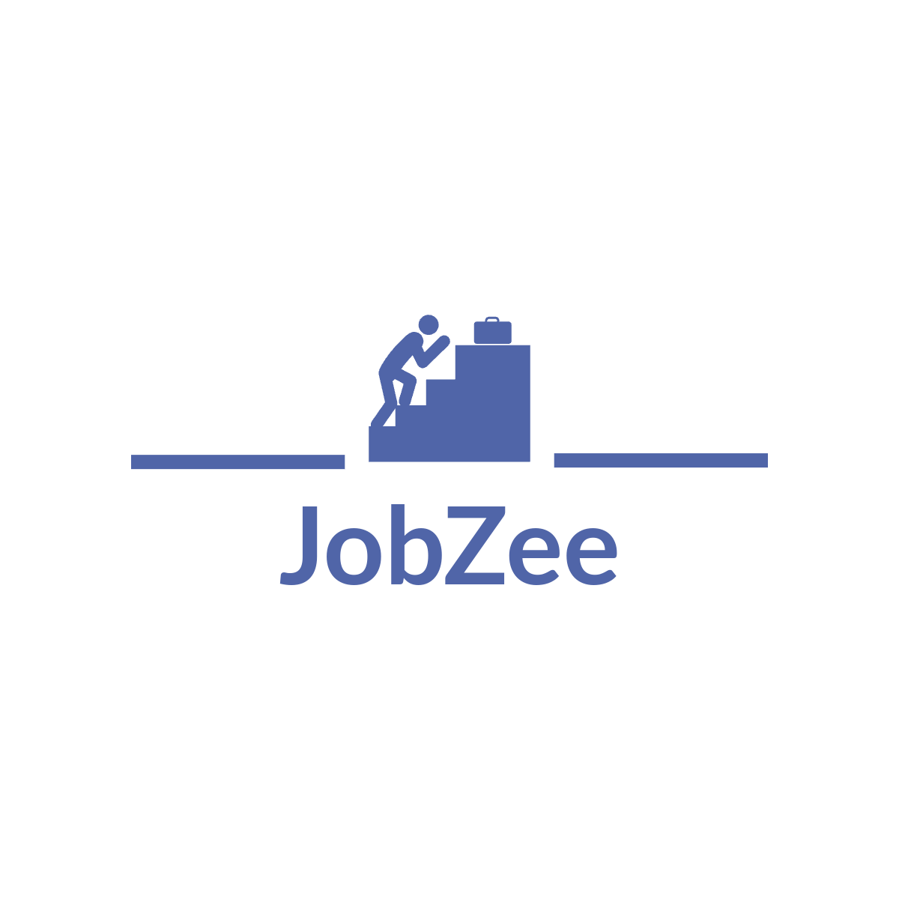

# 💼 JobZee - Job Portal Platform

<p align="center">
  
</p>

<p align="center">

🚀 A Full Stack MERN Job Portal Platform where Employers can post jobs and Job Seekers can search, apply, and manage applications seamlessly.


</p>

---

# 📌 Overview

JobZee is a modern MERN Stack Job Portal Platform designed for both recruiters and job seekers.

Employers can:

- Post Jobs
- Manage Job Listings
- View Applicants
- Delete Jobs

Job Seekers can:

- Register/Login
- Search Jobs
- Apply with Resume
- Track Applications
- Manage Profile

---

# 🖼️ Project Preview

## Home Page


---

## Login Page


---

## Register Page


---

# ✨ Features

## 👨‍💼 Recruiter

- Post New Jobs
- Update Job Details
- Delete Jobs
- View Applicants
- Dashboard

## 👨‍🎓 Job Seeker

- User Authentication
- Browse Jobs
- Apply Jobs
- Upload Resume
- View Applied Jobs

## 🔒 Authentication

- JWT Authentication
- Password Encryption (bcrypt)
- Cookie Authentication
- Protected Routes

---

# 🛠 Tech Stack

## Frontend

- React.js
- React Router DOM
- Axios
- React Icons
- React Hot Toast

## Backend

- Node.js
- Express.js
- MongoDB
- Mongoose
- JWT
- Bcrypt

---

# 📂 Folder Structure

```
JobZee
│
├── frontend
│   ├── src
│   ├── public
│   └── package.json
│
├── backend
│   ├── controllers
│   ├── models
│   ├── routes
│   ├── middlewares
│   ├── database
│   └── package.json
│
└── README.md
```

---

# ⚙ Installation

## Clone Repository

```bash
git clone https://github.com/your-username/JobZee-Job-Portal-Platform.git
```

Move into project

```bash
cd JobZee-Job-Portal-Platform
```

---

## Backend Setup

```bash
cd backend
npm install
```

Create a `.env`

```env
PORT=4000

MONGO_URI=your_mongodb_url

JWT_SECRET_KEY=your_secret_key

JWT_EXPIRE=7d

COOKIE_EXPIRE=7

CLOUDINARY_CLIENT_NAME=

CLOUDINARY_CLIENT_API=

CLOUDINARY_CLIENT_SECRET=
```

Run backend

```bash
npm run dev
```

---

## Frontend Setup

```bash
cd frontend

npm install

npm run dev
```

---

# 📸 Screenshots

| Home | Login |
|------|------|
|  |  |

| Register |
|------|
|  |

---

# 🔐 Authentication Flow

```
Register

      ↓

Login

      ↓

JWT Generated

      ↓

Cookie Stored

      ↓

Protected Routes

      ↓

Apply Job
```

---

# 🚀 Future Improvements

- Email Verification
- Job Recommendation
- Admin Dashboard
- Resume Builder
- Notifications
- Interview Scheduler
- Company Reviews
- Chat Support

---

# 👨‍💻 Author

**Sakshi Singh**


---

# ⭐ Support

If you like this project,

Give it a ⭐ on GitHub.
